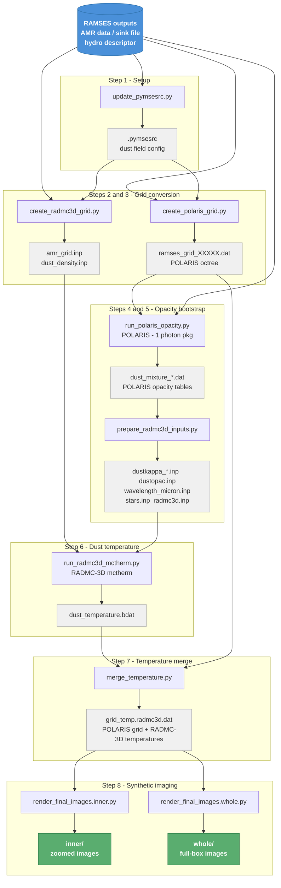

# Galactica — RAMSES → RADMC-3D / POLARIS Post-Processing Pipeline

Radprocess is a pipeline for post-processing [RAMSES](https://bitbucket.org/rteyssie/ramses) MHD simulation outputs to produce synthetic dust-continuum images. It uses [RADMC-3D](https://www.ita.uni-heidelberg.de/~dullemond/software/radmc-3d/) to compute the dust temperature via Monte Carlo radiative transfer (mctherm), and [POLARIS](https://portia.astrophysik.uni-kiel.de/polaris/) to generate the final synthetic observations. The two codes share a common set of dust opacities: POLARIS generates the opacity table first, which is then converted into the RADMC-3D format so that both codes operate on exactly the same dust model.

---

## Pipeline overview



The key design choice is to let **POLARIS** generate the dust opacities first using a single photon package (steps 4–5), so no thermal computation takes place. Those opacity tables are then converted into RADMC-3D format so that **RADMC-3D** performs the mctherm run (step 6) with identical opacities. The resulting dust temperature is injected back into the POLARIS grid (step 7) before the final imaging run (step 8), ensuring full physical consistency between the two codes.

---

## Dependencies

### External codes (must be installed and accessible in `PATH`)

| Code | Role |
|------|------|
| [RADMC-3D](https://www.ita.uni-heidelberg.de/~dullemond/software/radmc-3d/) | Dust temperature Monte Carlo (mctherm) |
| [POLARIS](https://portia.astrophysik.uni-kiel.de/polaris/) | Dust opacity generation and synthetic imaging |

### Python environment

Requires **Python 3.10.16**.

| Package | Version | Purpose |
|---------|---------|---------|
| [NumPy](https://numpy.org/) | 1.26.4 | Array operations and binary I/O |
| [Cython](https://cython.org/) | 3.0.11 | Build dependency required to compile PyMSES |
| [PyMSES](https://irfu.cea.fr/Projets/PYMSES/) | — | Reading RAMSES AMR outputs |
| [Astropy](https://www.astropy.org/) | 6.1.3 | Physical constants and unit conversions |
| [PyYAML](https://pyyaml.org/) | 6.0.2 | Reading the `config.yaml` configuration file |

---

## Configuration

All scripts read a single `config.yaml` file located in the working directory. It should specify, at minimum:

- paths to the RAMSES output directory and the specific output number
- paths to the POLARIS and RADMC-3D run directories
- star/sink properties (or let `utils.py` derive them from the RAMSES sink file)
- dust model parameters (grain size range, number of size bins, species)
- imaging parameters (viewing angles, image resolution, wavelengths, field of view)

Edit `config.yaml` before running any script.

---

## Usage

### Run the full pipeline automatically

```bash
python run_fullpipeline.py
```

This executes all steps in order using `subprocess`.

### Run steps individually

Each script can also be run standalone. The recommended order is:

```bash
python update_pymsesrc.py
python create_polaris_grid.py
python create_radmc3d_grid.py
python run_polaris_opacity.py
python prepare_radmc3d_inputs.py
python run_radmc3d_mctherm.py
python merge_temperature.py
python render_final_images.inner.py
python render_final_images.whole.py
```

---

## Script descriptions

### `run_fullpipeline.py`
Top-level orchestrator. Calls every pipeline step sequentially via `subprocess`. Start here if you want to run the full pipeline unattended.

---

### `update_pymsesrc.py`
Reads the RAMSES hydro descriptor file to identify dust ratio fields (e.g. `dust_ratio_1`, `dust_ratio_2`, …) and injects their definitions into the PyMSES configuration file (`.pymsesrc`, stored as JSON). This step is required before PyMSES can read dust fields from the RAMSES outputs.

---

### `create_polaris_grid.py`
Reads the RAMSES AMR grid via PyMSES (gas density, magnetic field, velocity, temperature, and dust fractions if present) and converts it into a binary octree file in POLARIS format. If the simulation contains no dust, a single virtual dust species is created at 1 % of the gas density.

Calls `convert_ramses2polaris()` from `ram2pol.py`.

---

### `create_radmc3d_grid.py`
Performs the same RAMSES → octree conversion as above but writes the output in RADMC-3D format: `amr_grid.inp` (the refinement structure) and `dust_density.inp` (one density field per dust species).

Calls `convert_ramses2radmc3d()` from `ram2rad.py`.

---

### `run_polaris_opacity.py`
Generates a POLARIS command file (`.cmd`) that instructs POLARIS to run with **a single photon package**. The sole purpose is to produce the POLARIS dust opacity table (`dust_mixture_*.dat`) without doing any meaningful radiative transfer. Stellar sources are read from the RAMSES sink file. The POLARIS binary is then executed and its output is logged.

---

### `prepare_radmc3d_inputs.py`
Converts the POLARIS-generated opacity tables into the RADMC-3D format and writes all remaining RADMC-3D input files:

| File | Content |
|------|---------|
| `dustkappa_<species>.inp` | Opacity per dust species (κ_abs, κ_sca, g) |
| `dustopac.inp` | Dust opacity index file |
| `wavelength_micron.inp` | Wavelength grid |
| `stars.inp` | Stellar source positions, radii, temperatures |
| `radmc3d.inp` | Solver settings (photon count, threads, scattering mode) |

Using POLARIS-generated opacities here guarantees that both codes see an identical dust model.

---

### `run_radmc3d_mctherm.py`
Changes into the RADMC-3D run directory and executes:

```
radmc3d mctherm
```

The Monte Carlo thermal computation produces `dust_temperature.bdat`, containing the dust temperature in every grid cell. Standard output is captured and written to a log file.

---

### `merge_temperature.py`
Reads the binary `dust_temperature.bdat` produced by RADMC-3D and injects those temperatures (parameter ID 2) back into the POLARIS binary grid, replacing the original POLARIS temperature values cell by cell. The result is written as a new POLARIS grid file (`grid_temp.radmc3d.dat`) that carries the RADMC-3D thermal solution.

---

### `render_final_images.inner.py` / `render_final_images.whole.py`
Both scripts generate POLARIS command files for the final imaging run and execute POLARIS. They differ only in the spatial extent of the image:

- **inner** — zoomed in by a factor of 10 (resolving inner structure)
- **whole** — full simulation box

Each script loops over the viewing angles defined in `config.yaml` (xy, xz, yz planes) and produces one image per angle per wavelength. Results are written into `inner/` and `whole/` output subdirectories.

---

### `ram2pol.py` / `ram2rad.py`
Low-level conversion libraries (not run directly). They implement the octree traversal and binary serialization for POLARIS and RADMC-3D respectively, handling unit conversions from RAMSES code units to SI/cgs via Astropy.

---

### `utils.py`
Shared helper functions used by multiple scripts:

- `check_simulation_has_dust()` — detects whether `ndust > 0` in the RAMSES info file
- `get_dust_species_count()` — returns the number of dust species
- `get_stars_properties()` / `derive_stars_properties()` — reads the RAMSES sink file and derives stellar luminosity, temperature, and radius via the Stefan–Boltzmann law
- `get_star_positions()` — convenience wrapper for sink coordinates
- `get_sink_format()` — auto-detects the column layout of the sink file

---

## Output files

| File | Produced by | Description |
|------|-------------|-------------|
| `ramses_grid_XXXXX.dat` | `create_polaris_grid.py` | POLARIS octree grid |
| `amr_grid.inp` | `create_radmc3d_grid.py` | RADMC-3D AMR refinement structure |
| `dust_density.inp` | `create_radmc3d_grid.py` | Dust density per species |
| `dust_mixture_*.dat` | `run_polaris_opacity.py` | POLARIS dust opacity tables |
| `dustkappa_*.inp` | `prepare_radmc3d_inputs.py` | RADMC-3D opacity per species |
| `dust_temperature.bdat` | `run_radmc3d_mctherm.py` | RADMC-3D dust temperature |
| `grid_temp.radmc3d.dat` | `merge_temperature.py` | Final POLARIS grid (RADMC-3D temperatures) |
| `inner/`, `whole/` | `render_final_images.*.py` | Synthetic images |
